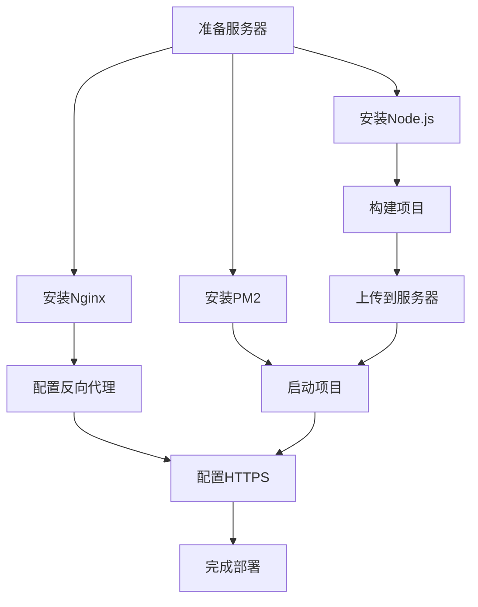

---
title: Next.js 项目部署到阿里云 ECS 完整指南
date: 2026-07-25
description: 从零开始，将 Next.js 项目部署到阿里云 ECS 服务器的完整步骤
category: 运维
tags: [Next.js, 阿里云, 部署, Nginx]
---

# Next.js 项目部署到阿里云 ECS 完整指南

本文详细介绍如何将 Next.js 项目部署到阿里云 ECS 服务器。

## 一、服务器环境准备

### 1. 安装 Node.js

```bash
# 使用 NodeSource 安装 Node.js 20.x
curl -fsSL https://rpm.nodesource.com/setup_20.x | sudo bash -
sudo yum install -y nodejs
```

### 2. 安装 PM2 进程管理器

```bash
npm install -g pm2
```

### 3. 安装 Nginx

```bash
sudo yum install -y nginx
sudo systemctl start nginx
sudo systemctl enable nginx
```

## 二、项目构建与上传

### 1. 本地构建

```bash
npm run build
```

### 2. 上传到服务器

使用 scp 或 rsync 将项目文件上传到服务器。

## 三、配置 Nginx 反向代理

```nginx
server {
    listen 80;
    server_name your-domain.com;

    location / {
        proxy_pass http://localhost:3000;
        proxy_http_version 1.1;
        proxy_set_header Upgrade $http_upgrade;
        proxy_set_header Connection 'upgrade';
        proxy_set_header Host $host;
        proxy_cache_bypass $http_upgrade;
    }
}
```

## 四、启动项目

```bash
pm2 start npm --name "blog" -- start
pm2 save
pm2 startup
```

## 五、配置 HTTPS

使用 Let's Encrypt 免费证书：

```bash
sudo certbot --nginx -d your-domain.com
```

## 思维导图

下面是部署流程的思维导图：


